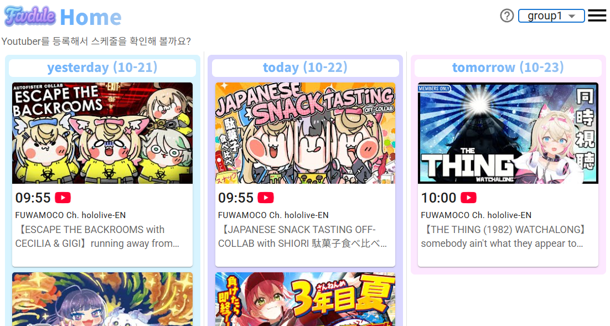
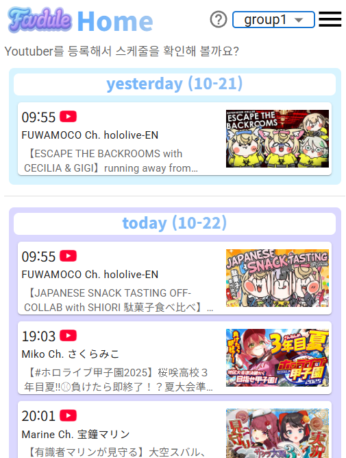
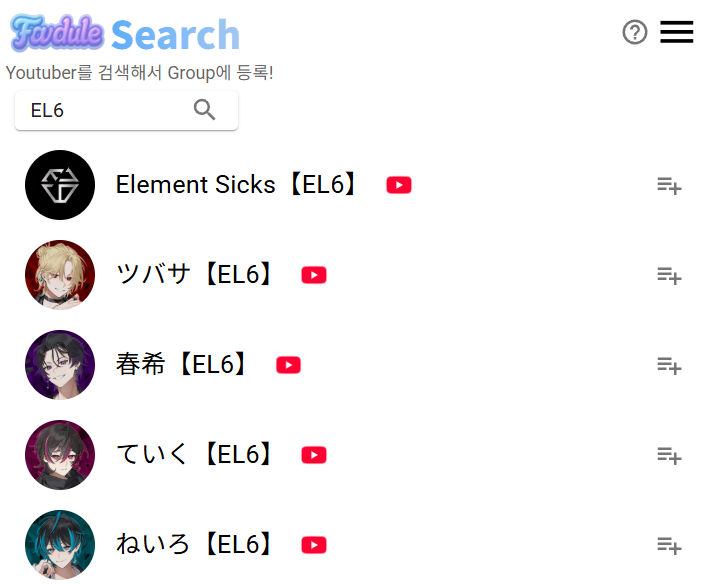

このプロジェクトの README は日本語と韓国語で提供いたします。
<br>
이 프로젝트의 README는 한국어와 일본어로 제공됩니다.

- [日本語 (Japanese)](README_jp.md)
- [한국어 (Korean)](README.md)

# Favdule


좋아하는 YouTuber의 방송 일정을 한눈에 확인할 수 있는 웹 서비스입니다.  
소속사 / 개인 여부와 관계없이, 내가 선택한 채널만 그룹으로 묶어  
어제 · 오늘 · 내일의 영상을 간편하게 확인할 수 있습니다.

# 현제 로그인기능 중지

- 배포환경이 구축되면 시동예정

## 🎥 서비스 UPL : https://favdule.onrender.com/

My Youdule help page : https://favdule.onrender.com/help

## 🚀 주요 기능

### 1. 홈(Home)

- 그룹 필터링 (드롭다운으로 그룹 선택)
- 선택된 그룹의 채널 영상 일정 표시 (어제/오늘/내일)
- 영상 카드를 클릭하면 유튜브로 바로 이동

| Web                                            | mobile                                                |
| ---------------------------------------------- | ----------------------------------------------------- |
|  |  |

### 2. 그룹(Groups)

- **비회원**: 4개의 그룹까지 사용 가능
- **회원**: 무제한 그룹 생성 가능
- 그룹명 수정 (연필 아이콘), 그룹 삭제 (버튼/휴지통 아이콘)
- 등록된 채널 삭제 가능


### 3. 검색(Search)

- 채널명 검색 후 그룹에 추가
- 추가 버튼으로 그룹에 저장
- 회원은 구글 계정의 구독 채널 15개 자동 조회 가능



### 4. 페이지 이동 / 로그인

- 메뉴 → 사이드 네비게이션(Home / Groups / Search)
- 상단 `로그인하기` 버튼으로 로그인 가능
- Google 계정 로그인
- 로그인 시 그룹/채널이 계정에 안전하게 저장됨


---

## 🛠️ 기술 스택

| 구분         | 기술                                       |
| ------------ | ------------------------------------------ |
| **Frontend** | React, Vite, CSS, MUI                      |
| **Backend**  | Node.js (Express), MySQL                   |
| **Auth**     | Google OAuth                               |
| **API**      | YouTube Data API v3                        |
| **Infra**    | Docker                                     |
| **Deploy**   | Render (frontend, backend), AWS (Database) |

---

## ⚙️ 프로젝트 구조 (Project Structure)

```
project/
├── backend/              # Express 서버
│   └── src/
│        ├── controllers/      # 기능별 로직
│        ├── routes/           # API 엔드포인트
│        ├── models/           # 데이터베이스 쿼리 모듈 (직접 SQL 사용)
│        └── config/           # DB 접속 설정
│
├── frontend/           # React
│   ├── public/           # 이미지
│   └── src/
│        ├── api/              # backend API 호출
│        ├── pages/            # 실제 라우팅되는 페이지
│        ├── components/       # 로그인 컴포넌트
│        ├── stores/           # 상태 관리 (예: user store)
│        ├── router/           # Router 설정
│        └── layouts/          # 공통 컴포넌트
```

---

## 🗄️ 데이터베이스 설계 (ERD)

아래는 본 프로젝트의 ERD입니다.


---


