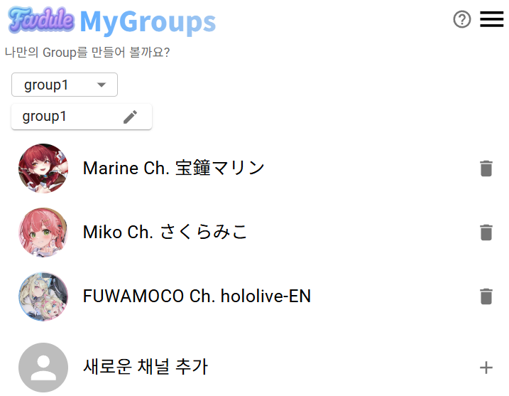
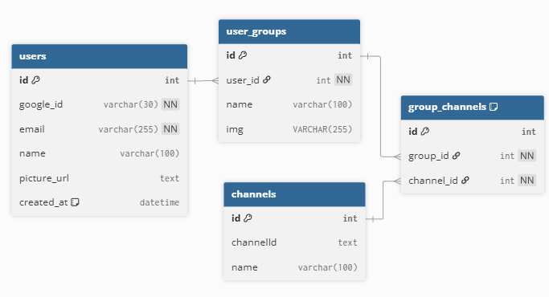

このプロジェクトの README は日本語と韓国語で提供いたします。
<br>
이 프로젝트의 README는 한국어와 일본어로 제공됩니다.

- [日本語 (Japanese)](README_jp.md)
- [한국어 (Korean)](README.md)

# My_Youdule


好きな YouTuber の配信スケジュールを一目で確認できる Web サービスです。  
所属事務所 / 個人に関係なく、自分が選んだチャンネルだけをグループ化して  
昨日・今日・明日の配信を簡単にチェックできます。

# 現在、ログイン機能閉鎖中
　- デプロイ環境が整い次第再開予定

## 🎥 サービス URL : https://myyoudule.onrender.com/
  My Youdule help page : https://myyoudule.onrender.com/help
  
## 🚀 主な機能

### 1. ホーム(Home)

- グループフィルタリング（ドロップダウンでグループ選択）
- 選択したグループのチャンネル配信スケジュールを表示（昨日/今日/明日）
- 配信カードをクリックすると YouTube に移動

| Web                                            | Mobile                                                |
| ---------------------------------------------- | ----------------------------------------------------- |
|  |  |

### 2. グループ(Groups)

- **非会員**: 4 つのグループを利用可能
- **会員**: 無制限でグループを作成可能
- グループ名編集（鉛筆アイコン）、グループ削除（ボタン）
- 登録済みチャンネルの削除が可能（ゴミ箱アイコン



### 3. 検索(Search)

- チャンネル名を検索してグループに追加
- 追加ボタンでグループに保存
- 会員は Google アカウントの登録チャンネル 15 件を自動取得可能


### 4. ページ移動 / ログイン

- メニュー → サイドナビゲーション(Home / Groups / Search)
- 上部の `ログイン` ボタンからログイン可能
- Google アカウントでのログインに対応
- ログイン時、グループ/チャンネルがアカウントに安全に保存される


---

## 🛠️ 技術スタック

| 区分         | 技術                                       |
| ------------ | ------------------------------------------ |
| **Frontend** | React, Vite, CSS, MUI                      |
| **Backend**  | Node.js (Express), MySQL                   |
| **Auth**     | Google OAuth                               |
| **API**      | YouTube Data API v3                        |
| **Infra**    | Docker                                     |
| **Deploy**   | Render (frontend, backend), AWS (Database) |

---

## ⚙️ プロジェクト構成 (Project Structure)

```
project/
├── backend/              # Express サーバー
│   └── src/
│        ├── controllers/      # 機能別ロジック
│        ├── routes/           # APIエンドポイント
│        ├── models/           # データベースクエリモジュール (直接SQLを使用)
│        └── config/           # DB接続設定
│
├── frontend/           # React
│   ├── public/           # 画像
│   └── src/
│        ├── api/              # backend API 呼び出し
│        ├── pages/            # ルーティングされるページ
│        ├── components/       # ログインコンポーネント
│        ├── stores/           # 状態管理 (例: user store)
│        ├── router/           # Router設定
│        └── layouts/          # 共通コンポーネント
```

---
## 🗄️ データベース設計 (ERD)

下記は本プロジェクトのER図です。


---


